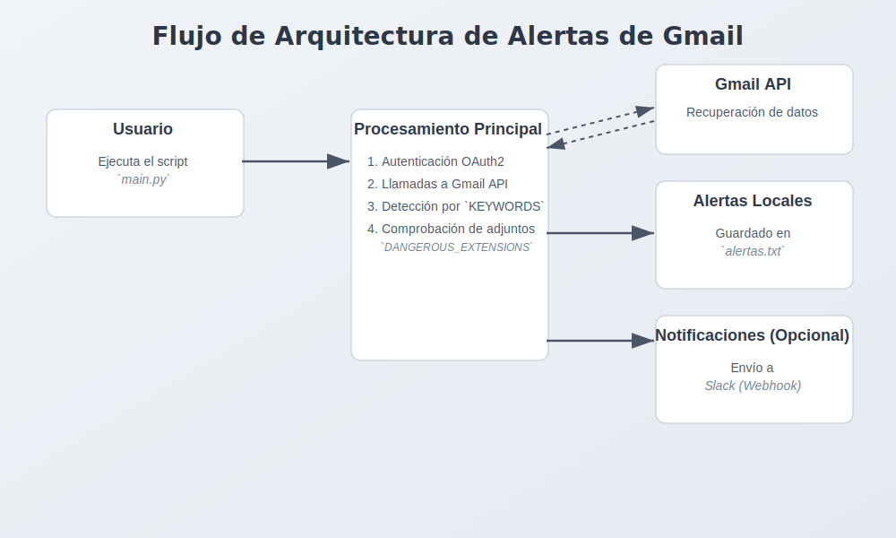

# gmail-alerting-app

Descripción
-
`gmail-alerting-app` es una utilidad en Python que conecta con la API de Gmail (vía OAuth2), lee los mensajes recientes de la cuenta autorizada, detecta palabras clave o adjuntos potencialmente peligrosos y genera alertas. Las alertas se registran localmente en `alertas.txt` y opcionalmente se envían a Slack mediante un Webhook definido en la variable de entorno `WEBHOOK_URL`.

## Diagrama de arquitectura




Características principales
-
- Conexión segura a Gmail mediante OAuth2 y almacenamiento del token en `token.json`.
- Análisis de los últimos correos (por defecto `maxResults=10`) buscando palabras clave en asunto/snippet.
- Detección básica de adjuntos peligrosos por extensión (p. ej. `.zip`, `.exe`, `.js`, `.bat`).
- Registro de alertas en `alertas.txt` y salida por consola.
- Notificación a Slack si se define `WEBHOOK_URL`.

Requisitos previos
-
- Desarollado en python 3.14.
- Una cuenta de Google con acceso a Gmail y un proyecto en Google Cloud con la API de Gmail habilitada.
- Archivo `credentials.json` (credenciales de OAuth 2.0) descargado desde Google Cloud Console.
- Conexión a internet para autorizar y usar la API.

Dependencias de Python
-
El proyecto utiliza las siguientes librerías principales. Puedes instalarlas usando `pip install -r requirements.txt`.

- **`google-api-python-client`**: Es la biblioteca cliente oficial de Google para Python. Permite interactuar con las APIs de Google, en este caso, la API de Gmail para leer mensajes.
- **`google-auth` y `google-auth-oauthlib`**: Estas librerías gestionan el flujo de autenticación y autorización (OAuth2). `google-auth` se encarga de manejar las credenciales, mientras que `google-auth-oauthlib` facilita la obtención de tokens de acceso mediante un flujo que se integra con el navegador.
- **`requests`**: Una librería HTTP sencilla y popular. En este proyecto se utiliza para enviar las notificaciones de alerta a un *webhook* de Slack.
- **`python-dotenv`**: (Opcional) Permite cargar variables de entorno desde un archivo `.env`. Es útil para no exponer datos sensibles como el `WEBHOOK_URL` directamente en el código.

Recomendación: crear un entorno virtual y luego instalar dependencias.

Instalación rápida

1) Crear y activar un entorno virtual

Windows (PowerShell):

```powershell
python -m venv .venv
.\.venv\Scripts\Activate.ps1
```

macOS / Linux:

```bash
python3 -m venv .venv
source .venv/bin/activate
```

2) Opciones para instalar dependencias

- Instalar paquetes manualmente (útil si quieres control por paquete):

```bash
pip install --upgrade pip
pip install google-auth google-auth-oauthlib google-api-python-client requests python-dotenv
```

- Usar el `requirements.txt` incluido (recomendado para reproducibilidad):

```bash
pip install --upgrade pip
pip install -r requirements.txt
```

Preparar credenciales y permisos
-
1. En Google Cloud Console:
	- Crear un proyecto (o usar uno existente).
	- Habilitar la API de Gmail (Gmail API).
	- Crear credenciales OAuth 2.0 (Application type: Desktop app) y descargar el archivo `credentials.json`.
	- También es crucial añadir el usuario o usuarios de pruebas en la sección de "Audience" dentro de la configuración de OAuth Consent Screen en Google Cloud.

2. Colocar `credentials.json` en la raíz del repositorio (junto a `main.py`).

3. Variables de entorno (opcional):
	- `WEBHOOK_URL`: URL del Webhook de Slack para recibir notificaciones. Si no se define, las alertas sólo se registran localmente.
	- `LOG_LEVEL`: nivel de verbosidad del logging. Valores válidos: `DEBUG`, `INFO`, `WARNING`, `ERROR`, `CRITICAL`. Si no se define, por defecto se usa `INFO`.
	- `GMAIL_MAX_RESULTS`: Número máximo de correos electrónicos a procesar en cada ejecución, Por defecto es 10 si no se especifica
	- Puedes usar un archivo `.env` con un ejemplo mínimo:

```
WEBHOOK_URL=https://hooks.slack.com/services/XXXXX/XXXXX/XXXXX
LOG_LEVEL=WARNING
```

Funcionamiento y primer arranque
-
- Al ejecutar `python main.py` por primera vez, el script lanzará el flujo de autorización de Google en el navegador (usando `InstalledAppFlow`).
- Tras completar la autorización, se generará `token.json` con los tokens necesarios. Ese archivo permite renovaciones sin reautorizar manualmente (siempre y cuando exista `refresh_token`).
- El script consulta mensajes con `users().messages().list(..., maxResults=10)` y luego obtiene cada mensaje con `users().messages().get(...)`.

Archivo de logs y salidas
-
- `alertas.txt`: archivo de texto (codificación UTF-8) donde se guardan las entradas registradas por `logging`.
- `token.json`: archivo generado tras la autorización con el token de acceso/refresh.

Configuración rápida dentro del código
-
- Las siguientes constantes están en la parte superior de `main.py` y puedes ajustarlas directamente o cambiar el código para cargarlas desde un archivo de configuración:
  - `KEYWORDS`: lista de palabras clave a detectar en asunto/snippet.
  - `WHITELIST_DOMAINS`: dominios que se excluyen del análisis.
  - `DANGEROUS_EXTENSIONS`: extensiones de archivos consideradas peligrosas.
  - `SCOPES`: scopes de OAuth (por defecto `['https://www.googleapis.com/auth/gmail.readonly']`).

Ajustar nivel de logs
-
El script usa el módulo estándar `logging` (configurado en `main.py` con `logging.basicConfig`). Los niveles disponibles son, en orden ascendente de severidad: `DEBUG`, `INFO`, `WARNING`, `ERROR`, `CRITICAL`.

Formas de cambiar el nivel de logs:

- Usando una variable de entorno (recomendado para no editar el código). Por ejemplo en PowerShell:

```powershell
$env:LOG_LEVEL = "DEBUG"
python main.py
```

Si usas un archivo `.env`, añade `LOG_LEVEL=DEBUG` y `python-dotenv` cargará la variable al iniciar.

- Cambiando el código en `main.py` (ejemplo mínimo):

```python
import os, logging
level_name = os.getenv('LOG_LEVEL', 'INFO').upper()
level = getattr(logging, level_name, logging.INFO)
logging.basicConfig(level=level, format='%(asctime)s [%(levelname)s] %(message)s')
```

Consejo: `DEBUG` muestra la máxima información (útil para desarrollo), `INFO` es adecuado en producción ligera, y `WARNING`/`ERROR`/`CRITICAL` reducen la verbosidad a problemas reales.

Ejecución
-
```bash
python main.py
```
Solución de problemas comunes
-
- Error: `El archivo 'credentials.json' no se encontró` → Coloca el archivo `credentials.json` en la raíz del proyecto.
- No se envían notificaciones a Slack → Verifica que `WEBHOOK_URL` esté correctamente definida y sea accesible.
- El script abre una ventana del navegador para autorizar → Es normal en el primer arranque (flujos de OAuth de tipo desktop).
---
Por: Daniel Cordova